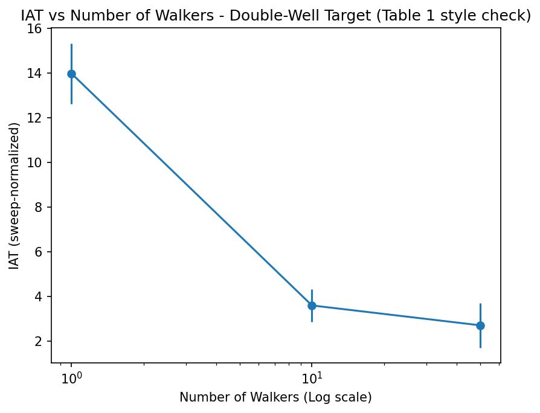

# Verification and Benchmark Results

*Phase 1 = core algorithm implementation and baseline sampler
verification. Phase 2 = scientific credibility work (reproducing/
comparing against the original paper's results). See the project's
GitHub issues for the full phase breakdown.*

## Phase 1 Baseline — RWMH JAX

Date: 2026-06-24
Settings: 50000 steps, burn-in 1000, step_size=1.0, key=PRNGKey(0)
Target: 2D Gaussian, mean=[2.0, -1.0], cov=[[1.0, 0.8],[0.8, 1.0]]

| Metric | True Value | JAX Result | Pass? |
|---|---|---|---|
| Mean dim 0 | 2.000 | 1.991 | ✓ |
| Mean dim 1 | -1.000 | -1.004 | ✓ |
| Cov [0,0] | 1.000 | 1.012 | ✓ |
| Cov [0,1] | 0.800 | 0.819 | ✓ |
| Cov [1,1] | 1.000 | 1.027 | ✓ |
| Acceptance rate | ~0.40 | 0.4106 | ✓ |

Assertions passed with atol=0.1

---

## Phase 1 Baseline — Goodman-Weare JAX

Date: 2026-06-24
Settings: 50 walkers, 2000 steps, burn-in 200, key=PRNGKey(0)
Target: 2D Gaussian, mean=[2.0, -1.0], cov=[[1.0, 0.8],[0.8, 1.0]]

| Metric | True Value | JAX Result | Pass? |
|---|---|---|---|
| Mean dim 0 | 2.000 | 1.991 | ✓ |
| Mean dim 1 | -1.000 | -0.997 | ✓ |
| Cov [0,0] | 1.000 | 1.007 | ✓ |
| Cov [0,1] | 0.800 | 0.804 | ✓ |
| Cov [1,1] | 1.000 | 1.001 | ✓ |
| Acceptance rate | ~0.70 | 0.7136 | ✓ |

Assertions passed with atol=0.1

## Phase 2 — IAT vs N, Double-Well Target (Table 1 style check)
Date: 2026-07-11
Settings: step_size=0.5, n_steps=20000, burn-in=2000, 10 random seeds per N
Target: Double-well target (not the paper's actual Table 1 target - Guassian process regression posterior). This is a 
Table-1-style efficiency check on our own already-validated target;
see Issue #7 for full reasoning.

| N  | Mean IAT | Std IAT | Mean Mode Coverage |
|----|----------|---------|--------------------|
| 1  | 13.99    | 1.35    | 0.500              |
| 10 | 3.60     | 0.73    | 0.501              |
| 50 | 2.71     | 1.00    | 0.499              |

**Result:** IAT decreases monotonically with N (confirmed across 10
seeds). Ratio IAT(1)/IAT(50) ≈ 5.2x which is below the 10-30x range originally
targeted (that range was borrowed from the paper's GP regression case,
not grounded in double-well data). N=10 and N=50 means overlap within
one std, suggesting most of the benefit of teleporting is captured by
N=10 on this target, with diminishing returns beyond that.
