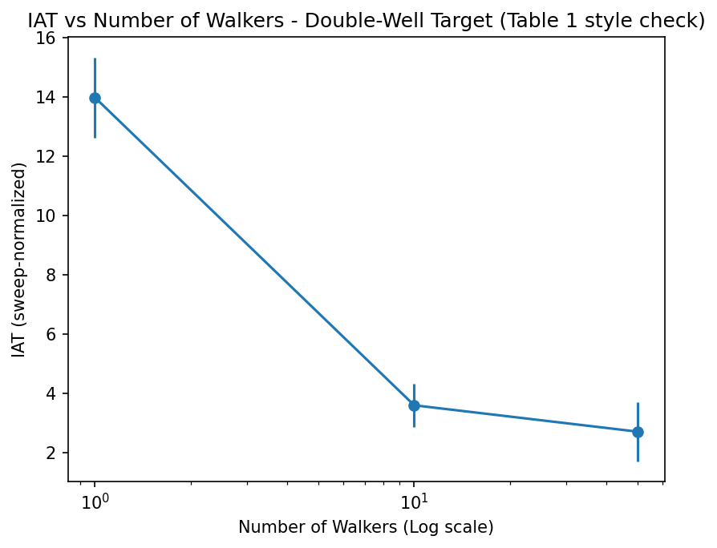
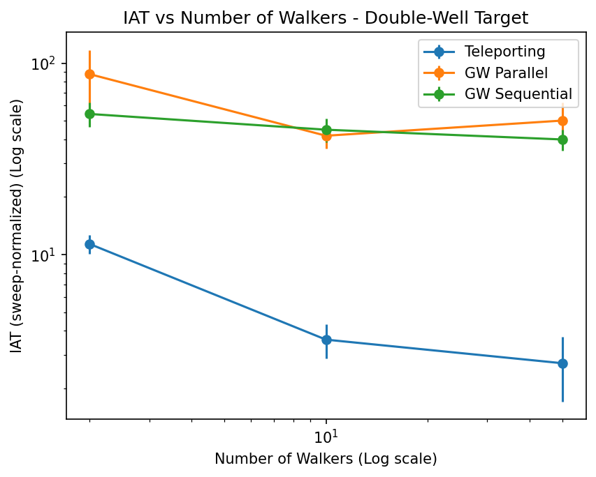
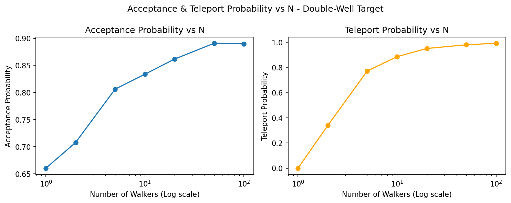
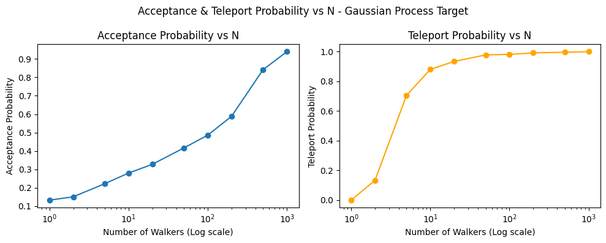
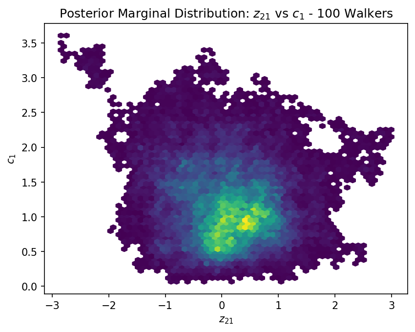
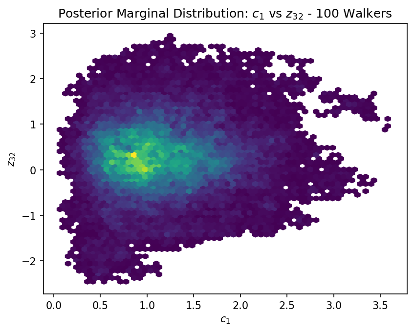
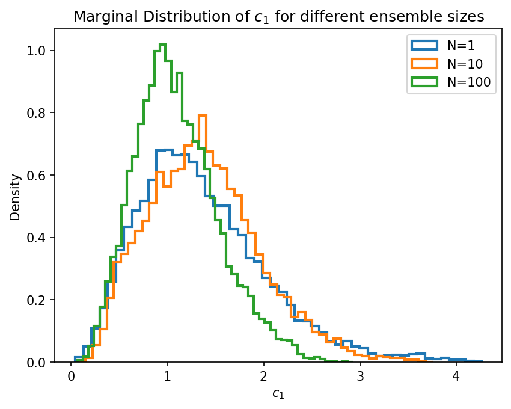
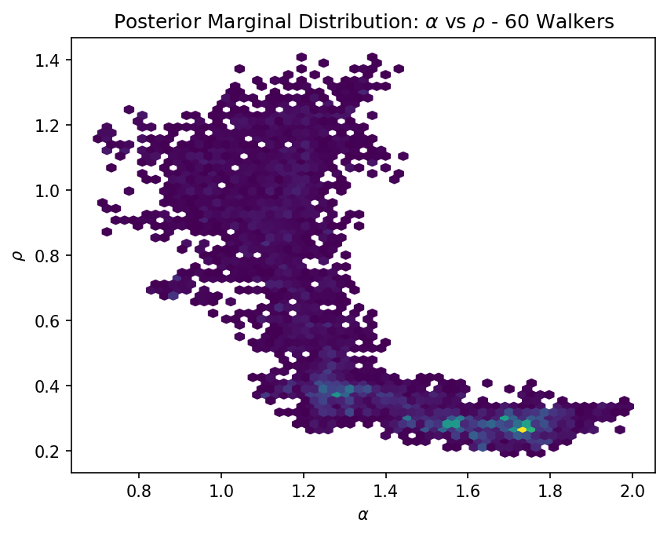

# Verification and Benchmark Results

*Phase 1 = core algorithm implementation and baseline sampler
verification. Phase 2 = scientific credibility work (reproducing/
comparing against the original paper's results). See the project's
GitHub issues for the full phase breakdown.*

## Phase 1 Baseline - RWMH JAX

Date: 2026-06-24
Settings: 50000 steps, burn-in 1000, step_size=1.0, key=PRNGKey(0)
Target: 2D Gaussian, mean=[2.0, -1.0], cov=[[1.0, 0.8],[0.8, 1.0]]

| Metric | True Value | JAX Result | Pass? |
|---|---|---|---|
| Mean dim 0 | 2.000 | 1.991 | ✓ |
| Mean dim 1 | -1.000 | -1.004 | ✓ |
| Cov [0,0] | 1.000 | 1.012 | ✓ |
| Cov [0,1] | 0.800 | 0.819 | ✓ |
| Cov [1,1] | 1.000 | 1.027 | ✓ |
| Acceptance rate | ~0.40 | 0.4106 | ✓ |

Assertions passed with atol=0.1

---

## Phase 1 Baseline - Goodman-Weare JAX

Date: 2026-06-24
Settings: 50 walkers, 2000 steps, burn-in 200, key=PRNGKey(0)
Target: 2D Gaussian, mean=[2.0, -1.0], cov=[[1.0, 0.8],[0.8, 1.0]]

| Metric | True Value | JAX Result | Pass? |
|---|---|---|---|
| Mean dim 0 | 2.000 | 1.991 | ✓ |
| Mean dim 1 | -1.000 | -0.997 | ✓ |
| Cov [0,0] | 1.000 | 1.007 | ✓ |
| Cov [0,1] | 0.800 | 0.804 | ✓ |
| Cov [1,1] | 1.000 | 1.001 | ✓ |
| Acceptance rate | ~0.70 | 0.7136 | ✓ |

Assertions passed with atol=0.1

## Phase 2 - IAT vs N, Double-Well Target (Table 1 style check)
Date: 2026-07-11
Settings: step_size=0.5, n_steps=20000, burn-in=2000, 10 random seeds per N
Target: Double-well target (not the paper's actual Table 1 target - Guassian process regression posterior). This is a 
Table-1-style efficiency check on our own already-validated target;
see Issue #7 for full reasoning.

| N  | Mean IAT | Std IAT | Mean Mode Coverage |
|----|----------|---------|--------------------|
| 1  | 13.99    | 1.35    | 0.500              |
| 10 | 3.60     | 0.73    | 0.501              |
| 50 | 2.71     | 1.00    | 0.499              |

**Result:** IAT decreases monotonically with N (confirmed across 10
seeds). Ratio IAT(1)/IAT(50) ≈ 5.2x which is below the 10-30x range originally
targeted (that range was borrowed from the paper's GP regression case,
not grounded in double-well data). N=10 and N=50 means overlap within
one std, suggesting most of the benefit of teleporting is captured by
N=10 on this target, with diminishing returns beyond that.

## Phase 2 — Teleporting vs. Goodman-Weare (Parallel & Sequential), Double-Well Target
Date: 2026-07-24 
Settings: step_size=0.5 (teleporting only; GW uses default stretch scale a=2.0),
n_steps=20000, burn_in=2000, 10 random seeds per (algorithm, N). N=2, 10, 50
tested for all three algorithms. N=1 is excluded, since Goodman-Weare (both
variants) is not well-defined at N=1 (see Issue in docs/buglog.md #8).
Target: Double-well target (teleport.targets.log_prob_doublewell). This
experiment originally set out to check whether Goodman-Weare fails to
explore both modes of the double-well target (a pass/fail check). Both
GW variants successfully explored both modes, so the experiment was
redirected to a quantitative IAT comparison instead.

| N  | Teleporting (IAT ± std) | GW Parallel (IAT ± std) | GW Sequential (IAT ± std) |
|----|--------------------------|---------------------------|-----------------------------|
| 2  | 11.37 ± 1.26             | 87.60 ± 29.52             | 54.28 ± 7.76                |
| 10 | 3.60 ± 0.73              | 41.77 ± 5.93              | 44.92 ± 6.29                |
| 50 | 2.71 ± 1.00              | 50.13 ± 12.29             | 39.94 ± 4.89                |

Mode coverage (fraction of post-burn-in samples in the right-hand well)
stayed between 0.497 and 0.504 for every algorithm/N/seed combination —
none of these IAT values reflect a stuck ensemble.

**Result:** Teleporting mixes roughly 10-20x faster (lower IAT) than
either Goodman-Weare variant, at every N tested. This gap is far larger
than the standard deviations involved, so it's a robust finding.
Whether sequential GW mixes faster than parallel/vmap GW specifically is
not established by this data as their IAT values cross between N=2,
10, and 50, with error bars that overlap substantially. This would need
more seeds or a proper statistical test to resolve. Findings are
specific to this double-well parameterization (a fairly shallow
barrier) and don't generalize to other targets. Full methodology and
discussion in notebooks/04_teleporting_vs_gw.ipynb.

## Phase 2 - Acceptance & Teleport Probability vs. N, Double-Well Target
Date: 2026-07-28
Settings: n_steps=5000, step_size=0.5, burnin=500, single seed (PRNGKey(42)) per N.
N = [1, 2, 5, 10, 20, 50, 100] tested. N=1 is included here, since
teleporting is well-defined at N=1 and reduces to standard MH and the teleport
probability is expected to be exactly 0 there.
Target: Double-well target (teleport.targets.log_prob_doublewell). This is a
double-well analog of Figure 5.5 from the paper; the
paper's actual Figure 5.5 uses the univariate Gaussian process regression posterior
from Section 5.2.1, not double-well. Note also that the paper's Figure 5.5 uses a
linear N-axis, while the plot below uses a log-x-axis since our chosen N values
aren't evenly spaced.

| N   | Accepted Prob | Teleported Prob | Mode Coverage |
|-----|---------------|------------------|---------------|
| 1   | 0.660         | 0.000            | 0.542         |
| 2   | 0.708         | 0.339            | 0.513         |
| 5   | 0.806         | 0.771            | 0.493         |
| 10  | 0.834         | 0.885            | 0.495         |
| 20  | 0.862         | 0.950            | 0.507         |
| 50  | 0.891         | 0.979            | 0.493         |
| 100 | 0.890         | 0.991            | 0.507         |

Mode coverage stayed between 0.493 and 0.542 across all N, confirming these
acceptance/teleport trends reflect ensemble behavior rather than a stuck ensemble.

**Result:** Both acceptance and teleport probability increase with N, qualitatively
matching the trend the paper describes for Figure 5.5, and both curves appear to
flatten out by N=50-100 rather than continuing to rise sharply which is consistent with the
diminishing-returns pattern already seen in Phase 1. These are single-seed results, so no error bars are
established and the specific values here should not be compared numerically against
the paper's own Figure 5.5, which uses a different target. 

## Phase 2 - Paper Examples 5.2.1-5.2.3 (Lindsey et al. 2022)

Date: 2026-08-19
These notebooks follow the Gaussian-process examples in Section 5.2 of
the paper. They reproduce the procedure, but will not be a numeric match to the paper’s tables and
figures. Full code and plots:

- [`notebooks/Example_5_2_1.ipynb`](../notebooks/Example_5_2_1.ipynb)
- [`notebooks/Example_5_2_2.ipynb`](../notebooks/Example_5_2_2.ipynb)
- [`notebooks/Example_5_2_3.ipynb`](../notebooks/Example_5_2_3.ipynb)

---

### 5.2.1 Univariate GP regression

**Target:** Squared-exponential GP posterior on synthetic 1-D data,
θ = (α, ρ, σ) with half-Cauchy priors and Gaussian noise
integrated out in closed form.

**Sampler:** full-interaction `teleporting_walkers_jax`.

**What we ran:** acceptance and teleport probability vs ensemble size and the IAT of
ensemble-averaged ρ vs ensemble size.

#### Acceptance & teleport probability vs N

Single-seed style check.

| N    | Accept prob | Teleport prob |
|------|-------------|---------------|
| 1    | 0.126       | 0.000         |
| 2    | 0.152       | 0.185         |
| 5    | 0.233       | 0.720         |
| 10   | 0.289       | 0.874         |
| 20   | 0.344       | 0.945         |
| 50   | 0.400       | 0.978         |
| 100  | 0.474       | 0.986         |
| 200  | 0.617       | 0.988         |
| 500  | 0.836       | 0.996         |
| 1000 | 0.944       | 0.998         |

**Result:** Both rates increase with N and flatten at large ensemble
size which is the same qualitative trend as the paper’s Figure 5.5. 

#### IAT of ensemble-averaged ρ vs N

| N  | Mean IAT | Std IAT |
|----|----------|---------|
| 1 | 361.846 | 229.679 |
| 10 | 65.535 | 22.161 |
| 50 | 19.348 | 7.409 |

**Result:** IAT of ρ̄ decreases as N grows. Treat
small-N estimates with caution when chains are shorter than ~50×τ.

---

### 5.2.2 Multivariate GP (n = 3)

**Target:** Product-mean GP in 3-D inputs, metric parameterized via
Bartlett / Cholesky factor Z, θ is 8-dimensional
(α, c₁, c₂, c₃, z₂₁, z₃₁, z₃₂, σ) with the paper’s positivity and
prior structure.

**Sampler:** full-interaction teleporting.

**What we ran:** IAT of ensemble-averaged c₁ vs N;, 2-D posterior
marginals, overlaid 1-D c₁ marginals for several N.

#### IAT of ensemble-averaged c₁ vs N

| N   | Mean IAT | Std IAT |
|-----|----------|---------|
| 10  | 569.86   | 230.32  |
| 20  | 306.11   | 142.38  |
| 50  | 196.01   | 56.09   |
| 100 | 125.31   | 5.30    |

**Result:** IAT falls with N (Table 2 style trend). Small N values sometimes
trigger emcee’s “chain shorter than 50×τ” warning; those entries are
rough and should not be taken as exact values.

#### Posterior marginals

**Result:** Mass is concentrated; larger N yields a more stable c₁
marginal. Plots are not identical to the paper’s Figures 5.6–5.7 due to different synthetic data and seeds.

---

### 5.2.3 Non-Gaussian (Student-t) noise + restricted interaction

**Target:** Same univariate mean structure as 5.2.1, but observation
noise is Student-t (ν = 2). Latents are reparameterized as
ε = y + K_θ^{1/2} w and state is (θ, w) = (α, ρ, σ, w₁, …, wₘ).

**Sampler:** restricted interaction (notebook prototype, not a stable
package API):

- teleport / interact only on θ
- 30 independent MH updates on w between θ steps
- `vmap` over walkers for the w-block

**What we ran:** correctness tests for the restricted teleporting algorithm, exploratory IAT of ρ̄ and 
Figure 5.8-style (α, ρ) marginal at N = 60.

#### Posterior marginal of (α, ρ)

**Result:** Restricted kernel runs end-to-end. The (α, ρ) marginal is
concentrated with α, ρ > 0, consistent with the paper’s qualitative
message that Student-t noise removes the strong multimodality seen in
the Gaussian-noise univariate case.
